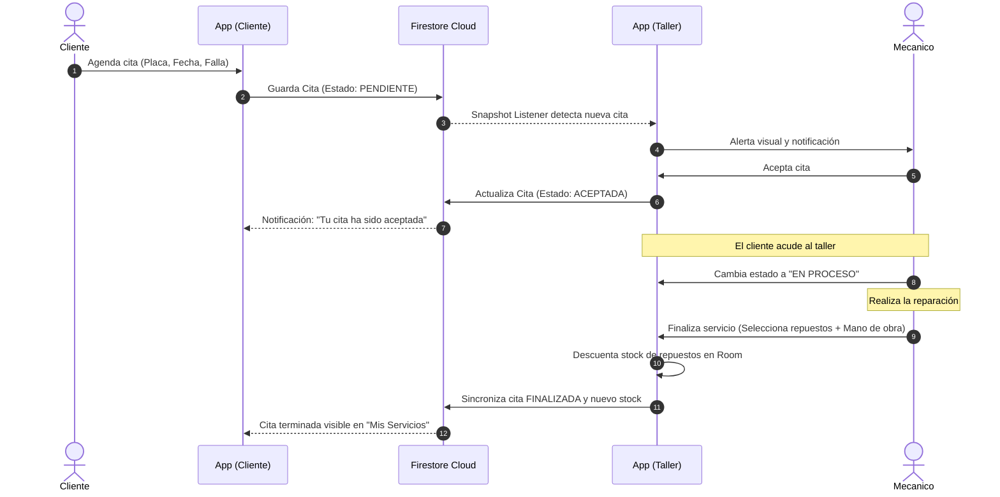
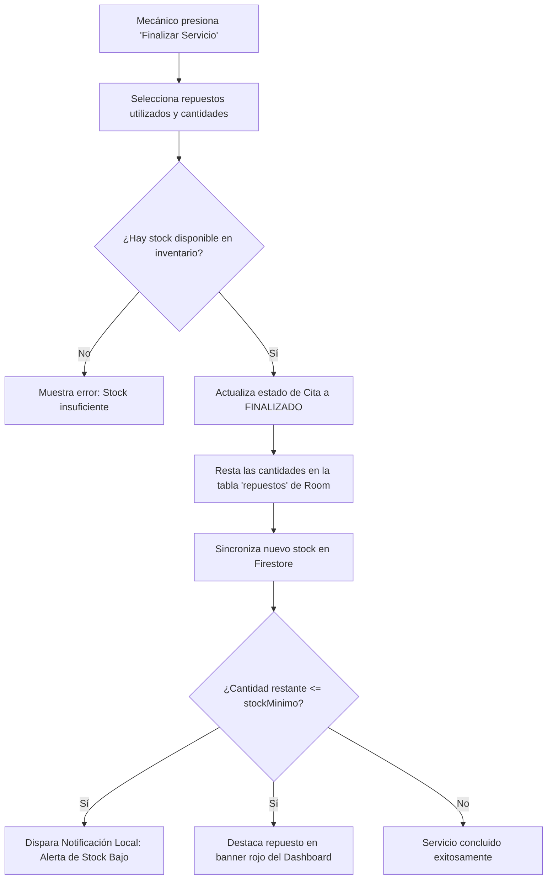

# MotoStock - Sistema Integral de Gestión de Taller y Control de Repuestos de Motocicletas

**MotoStock** es una aplicación móvil nativa para Android (desarrollada 100% en Kotlin) diseñada para digitalizar, optimizar y centralizar la operación diaria de talleres mecánicos de motocicletas, el control riguroso de repuestos en inventario y la comunicación bidireccional en tiempo real con los clientes propietarios.

El proyecto está construido bajo los estándares más modernos de la industria de desarrollo Android: **Arquitectura Limpia Modular (Clean Architecture)**, patrón de diseño reactivo **MVI (Model-View-Intent)**, interfaz declarativa en **Jetpack Compose (Material 3)**, persistencia local reactiva **Room (Offline-First)**, sincronización en la nube con **Firebase Firestore**, autenticación multi-rol con **Firebase Auth**, e integración de notificaciones push avanzadas mediante **Firebase Cloud Messaging (FCM)**.

---

## 📑 Tabla de Contenidos
1. [Visión General del Proyecto](#-visión-general-del-proyecto)
2. [Ecosistema de Roles y Permisos](#-ecosistema-de-roles-y-permisos)
3. [Módulos y Funcionalidades del Sistema](#-módulos-y-funcionalidades-del-sistema)
   - [1. Autenticación y Seguridad Multi-Rol](#1-autenticación-y-seguridad-multi-rol)
   - [2. Dashboard Operativo con Métricas en Vivo](#2-dashboard-operativo-con-métricas-en-vivo)
   - [3. Gestión Integral de Citas y Reservas](#3-gestión-integral-de-citas-y-reservas)
   - [4. Ejecución, Finalización de Servicios y Descuento de Stock](#4-ejecución-finalización-de-servicios-y-descuento-de-stock)
   - [5. Control de Inventario y Alertas de Stock Bajo](#5-control-de-inventario-y-alertas-de-stock-bajo)
   - [6. Registro Vehicular e Ingreso Directo a Taller](#6-registro-vehicular-e-ingreso-directo-a-taller)
   - [7. Historial Clínico de Servicios y Búsqueda por Placa](#7-historial-clínico-de-servicios-y-búsqueda-por-placa)
   - [8. Portal de Autogestión para Clientes](#8-portal-de-autogestión-para-clientes)
   - [9. Sistema de Notificaciones Push y Alertas](#9-sistema-de-notificaciones-push-y-alertas)
4. [Arquitectura del Software](#-arquitectura-del-software)
   - [Clean Architecture Multi-Módulo](#clean-architecture-multi-módulo)
   - [Patrón de Presentación: MVI (Model-View-Intent)](#patrón-de-presentación-mvi-model-view-intent)
   - [Estrategia de Datos: Offline-First Reactivo](#estrategia-de-datos-offline-first-reactivo)
   - [Inyección de Dependencias (Hilt)](#inyección-de-dependencias-hilt)
5. [Estructura del Proyecto (Módulos y Paquetes)](#-estructura-del-proyecto-módulos-y-paquetes)
6. [Modelo de Dominio y Datos](#-modelo-de-dominio-y-datos)
7. [Stack Tecnológico y Dependencias](#-stack-tecnológico-y-dependencias)
8. [Flujos de Trabajo Críticos](#-flujos-de-trabajo-críticos)

---

## 🎯 Visión General del Proyecto

En los talleres mecánicos tradicionales de motos, la gestión suele realizarse mediante cuadernos de apuntes o métodos informales, lo que provoca descontrol en el stock de repuestos, falta de seguimiento en el historial de fallas mecánicas de cada moto, y desinformación de los clientes respecto al estado de su vehículo.

**MotoStock** resuelve esta problemática conectando a tres actores clave en un único ecosistema digital:
- **Al Administrador del taller**, proporcionándole métricas globales, control total de inventario y la potestad exclusiva de dar de alta trabajadores.
- **A los Mecánicos / Trabajadores**, facilitándoles la recepción de motos, el control del estado de cada reparación, el registro de trabajos realizados y el consumo automático de piezas del almacén.
- **A los Clientes / Dueños de motos**, permitiéndoles agendar citas desde su teléfono, recibir notificaciones inmediatas de aprobación/rechazo, monitorear cuándo su vehículo entra en proceso y revisar qué piezas fueron reemplazadas con sus costos transparentes.

---

## 👥 Ecosistema de Roles y Permisos

La aplicación valida el rol del usuario directamente desde Firestore (`colección: usuarios/{uid}`) tras la autenticación y ajusta dinámicamente la navegación, menús y capacidades operativas:

| Rol | Pantallas Disponibles | Capacidades Principales |
| :--- | :--- | :--- |
| **Administrador** (`ADMINISTRADOR`) | Dashboard Global, Citas, Inventario, Historial, Crear Trabajador | • Visión global de citas activas e inventario.<br>• Creación segura de nuevas cuentas de trabajadores (mecánicos).<br>• Edición, adición y eliminación de repuestos.<br>• Gestión y auditoría de citas y servicios históricos. |
| **Trabajador / Mecánico** (`TRABAJADOR`) | Dashboard Mecánico, Gestión de Citas, Inventario, Historial, Registro Vehicular, En Taller | • Aceptar o rechazar citas (con motivo obligatorio).<br>• Poner vehículos "En Proceso" de reparación.<br>• Finalizar servicios: seleccionar repuestos usados y registrar costo de mano de obra.<br>• Consultar inventario y recibir avisos de stock crítico.<br>• Registrar ingresos vehiculares directos (sin cita previa). |
| **Cliente** (`CLIENTE`) | Dashboard Cliente, Agendar Cita, Mis Servicios | • Reservar citas indicando placa, modelo, fecha, hora deseada y descripción.<br>• Monitorear en vivo el estado de su cita/reparación.<br>• Consultar motivos en caso de cita rechazada o cancelada con opción de reagendar en un toque.<br>• Revisar el historial de piezas cambiadas y costos finales. |

---

## ⚡ Módulos y Funcionalidades del Sistema

### 1. Autenticación y Seguridad Multi-Rol
- **Métodos de ingreso**: Correo y contraseña o inicio de sesión con **Google Sign-In**.
- **Registro de Clientes**: Registro público abierto que asigna por defecto el rol de `CLIENTE`.
- **Creación Segura de Trabajadores**: Solo los administradores autenticados pueden crear cuentas para trabajadores. La app utiliza una instancia secundaria aislada de `FirebaseApp` (`MotoStockWorkerCreator`) para registrar la cuenta en Firebase Auth sin cerrar ni comprometer la sesión activa del administrador.
- **Sembrado Automático de Administrador (`AdminInitializer`)**: En entornos de desarrollo y pruebas, el sistema garantiza la existencia del usuario administrador predeterminado mediante una instancia secundaria aislada (`MotoStockAdminSeeder`), asegurando que la app nunca inicie sesión de forma automática ni altere el estado local de credenciales.

### 2. Dashboard Operativo con Métricas en Vivo
- Tarjetas de conteo en tiempo real de **Citas Pendientes**, **Citas En Proceso**, **Total Activas** y **Total de Repuestos en Stock**.
- **Banner reactivo de alerta de stock bajo**: Notifica visualmente cuántos repuestos han caído por debajo de su umbral mínimo configurado.
- Barra de navegación inferior dinámica (`MotoStockBottomBar`) adaptada exclusivamente según si el usuario es Trabajador/Admin o Cliente.

### 3. Gestión Integral de Citas y Reservas
- **Ciclo de vida completo de una cita**:
  $$\text{PENDIENTE} \longrightarrow \text{ACEPTADA} \longrightarrow \text{EN\_PROCESO} \longrightarrow \text{FINALIZADO}$$
  $$\searrow \quad \text{RECHAZADA} \quad \text{o} \quad \text{CANCELADA}$$
- **Filtro segmentado**: Pestañas de acceso rápido entre *"Todas"*, *"Pendientes"* y *"En Proceso"*.
- **Aceptación y Rechazo**: Al aceptar, se programa la atención; al rechazar o cancelar, se despliega un diálogo modal que exige ingresar el motivo, el cual se sincroniza al cliente y dispara una notificación push inmediata.

### 4. Ejecución, Finalización de Servicios y Descuento de Stock
- **Flujo de Finalización (`FinalizarServicioUseCase`)**:
  - Modal interactivo para seleccionar las piezas y repuestos utilizados del inventario disponible.
  - Validación estricta de stock en tiempo real: impide finalizar si la cantidad utilizada excede las existencias físicas.
  - Asignación del costo del servicio (mano de obra).
  - Cálculo automático del total a pagar (mano de obra + subtotal de repuestos).
  - **Descuento atómico del inventario**: Actualiza automáticamente las unidades disponibles de cada producto en la base de datos local y remota.
  - Registro de hora y fecha de salida del taller.
  - Serialización de los repuestos utilizados en formato estructurado (JSON) para consulta transparente por el cliente y el mecánico.

### 5. Control de Inventario y Alertas de Stock Bajo
- Catálogo completo de repuestos con atributos detallados: Nombre, Categoría, Stock actual, Stock mínimo de seguridad, Precio de compra, Precio de venta y Proveedor.
- **13 Categorías especializadas de motos**: Motor, Transmisión, Frenos, Suspensión y Chasis, Sistema Eléctrico, Ruedas y Neumáticos, Carrocería y Plásticos, Escape, Refrigeración, Aceites y Lubricantes, Filtros, Accesorios, Otros.
- **Buscador en tiempo real** por nombre, categoría o proveedor.
- Cálculo de rentabilidad por producto e indicador visual de piezas con stock crítico (`cantidad <= stockMinimo`).

### 6. Registro Vehicular e Ingreso Directo a Taller
- Pantalla dedicada (`RegistroVehicularScreen`) para registrar el ingreso de motocicletas que llegan directamente al taller sin cita previa agendada.
- Seguimiento visual de los vehículos actualmente en el taller (`EnTallerScreen`) para agilizar su entrega o paso a reparación.

### 7. Historial Clínico de Servicios y Búsqueda por Placa
- Búsqueda instantánea de atenciones pasadas filtrando por **número de placa**.
- **Filtro cronológico** por rango de fechas mediante `DatePickerDialog`.
- Detalle de cada servicio histórico: diagnóstico del problema, trabajo realizado, kilometraje, repuestos cambiados, técnico asignado y total facturado.
- **Integración con API Externa de Placas (`PlacaApiService`)**:
  - Cliente Retrofit preparado para consultar servicios de decodificación vehicular (ej. CarsXE Plate Decoder u otra API propia).
  - En caso de indisponibilidad o falla de la API, el sistema aplica una degradación elegante (*graceful fallback*), permitiendo la captura manual de los datos del vehículo sin interrumpir la operación.

### 8. Portal de Autogestión para Clientes
- **Agendar Cita**: Formulario intuitivo donde el cliente registra su placa, modelo, teléfono de contacto, tipo de servicio requerido, hora estimada de llegada y descripción de la falla.
- **Mis Servicios**: Lista en tiempo real de todas las solicitudes y citas del cliente.
  - Identificación por colores del estado actual (Pendiente, Aceptada, En Proceso, Finalizado, Rechazada, Cancelada).
  - Visualización del motivo de rechazo o cancelación.
  - **Botón "Reagendar"**: Permite duplicar los datos de una cita rechazada o finalizada para solicitar una nueva fecha con un solo clic.

### 9. Sistema de Notificaciones Push y Alertas
- Implementación de **Firebase Cloud Messaging (FCM)** con soporte para notificaciones en primer y segundo plano.
- **Canales de Notificación de Android 8.0+ (Oreo)**:
  - `channel_citas`: Notificaciones de alta prioridad para cambios de estado de citas.
  - `channel_stock`: Alertas de inventario para personal del taller.
- **Cola de mensajes en Firestore (`/fcm_queue`)**: El dispositivo del mecánico o del cliente encola solicitudes de notificación que pueden ser despachadas en segundo plano hacia los tokens FCM de los destinatarios mediante Cloud Functions.
- Notificaciones locales inmediatas cuando el stock de un repuesto cae por debajo del mínimo tras finalizar un servicio.

---

## 🏛 Arquitectura del Software

El proyecto sigue los principios de **Clean Architecture** combinados con una modularización física por capas y características (*features*), garantizando desacoplamiento, alta testeabilidad y mantenibilidad.

```
                    ┌──────────────────────────────┐
                    │       :app (Container)       │
                    │  MainActivity, NavGraph, DI  │
                    └──────────────┬───────────────┘
                                   │
              ┌────────────────────┴────────────────────┐
              ▼                                         ▼
   ┌──────────────────────┐                  ┌──────────────────────┐
   │   Feature Modules    │                  │     Core Modules     │
   │  :feature:auth       │                  │  :core:common (MVI)  │
   │  :feature:home       │                  │  :core:designsystem  │
   │  :feature:appointments                  │  :core:domain (Pure) │
   │  :feature:inventory  │                  │  :core:database(Room)│
   │  :feature:history    │                  │  :core:network       │
   │  :feature:client     │                  └──────────┬───────────┘
   │  :feature:admin      │                             │
   │  :feature:registration                             │
   └──────────┬───────────┘                             │
              │                                         │
              └────────────────────┬────────────────────┘
                                   ▼
                        ┌──────────────────────┐
                        │        :data         │
                        │ Repositories (Impl)  │
                        │ Room + Firestore Sync│
                        └──────────────────────┘
```

### Clean Architecture Multi-Módulo
- **Capa de Dominio (`:core:domain`)**: Código Kotlin puro (independiente del framework Android). Contiene las entidades (`Cita`, `Repuesto`, `Moto`, `ServicioHistorial`, `Usuario`), interfaces de repositorios y casos de uso de negocio (`FinalizarServicioUseCase`, `GetCitasUseCase`, `SaveRepuestoUseCase`, etc.).
- **Capa de Datos (`:data`, `:core:database`, `:core:network`)**: Implementaciones de repositorios, acceso a bases de datos SQLite con Room (DAOs y Entities), llamadas HTTP con Retrofit/OkHttp, y servicios de Firebase Firestore.
- **Capa de Presentación (`:feature:*`)**: Pantallas en Jetpack Compose, ViewModels y contratos MVI correspondientes a cada dominio funcional de la aplicación.
- **Capa de Diseño Compartido (`:core:designsystem`)**: Tokens de diseño centralizados (colores, tipografía, espaciados, formas, elevaciones) y componentes reutilizables (`MotoStockCard`, `MotoStockTextField`, etc.).

### Patrón de Presentación: MVI (Model-View-Intent)
Toda la interfaz de usuario se rige bajo un flujo de datos estrictamente unidireccional (*Unidirectional Data Flow - UDF*):
- **UiState**: Objeto inmutable que modela el estado exacto de la pantalla en cada instante.
- **UiIntent**: Acciones explícitas disparadas por el usuario (ej. `AceptarCita`, `GuardarRepuesto`, `FiltrarPorPlaca`).
- **UiEffect**: Eventos de un solo disparo que no pertenecen al estado persistente (navegación, mostrar Toasts o SnackBar), propagados a través de `Channel` de Coroutines.
- Cada ViewModel hereda de `MviViewModel<State, Intent, Effect>`, asegurando una estructura homogénea y predecible en toda la app.

### Estrategia de Datos: Offline-First Reactivo
1. La **fuente única de la verdad** para la UI es la base de datos local **Room**. Los ViewModels observan flujos `Flow<List<T>>` emitidos por Room.
2. En segundo plano, los repositorios mantienen escuchadores activos de Firestore (`addSnapshotListener`) que sincronizan en tiempo real cualquier cambio ocurrido en la nube directamente a las tablas de Room (`dao.replaceAll(...)`).
3. Al realizar una escritura o edición, se guarda inmediatamente en Room y se envía a Firestore (`set()` con `await()`). Esto garantiza que la aplicación funcione con fluidez instantánea y mantenga disponibilidad aún ante caídas momentáneas de red.

### Inyección de Dependencias (Hilt)
Se utiliza **Dagger Hilt 2.50** para conectar todas las dependencias entre módulos:
- `DatabaseModule`: Provee la instancia de `MotoStockDatabase` y todos los DAOs (`CitaDao`, `RepuestoDao`, `ServicioDao`, `MotoDao`).
- `FirebaseModule`: Provee instancias singleton de `FirebaseAuth` y `FirebaseFirestore`.
- `NetworkModule`: Configura OkHttp, Retrofit y la interfaz `PlacaApiService`.
- `RepositoryModule`: Vincula las interfaces del dominio con sus implementaciones concretas de la capa `:data`.

---

## 📂 Estructura del Proyecto (Módulos y Paquetes)

```text
MotoStock/
├── app/                                 # Contenedor de la aplicación
│   └── src/main/java/com/taller/motostock/app/
│       ├── initializer/AdminInitializer.kt  # Creación y verificación de cuenta admin
│       ├── navigation/MotoStockNavGraph.kt  # NavHost de Compose y barra de navegación
│       ├── ui/MainActivity.kt               # Única Activity contenedora (Edge-to-Edge)
│       └── MotoStockApp.kt                  # Clase Application con Hilt y canales FCM
│
├── core/
│   ├── common/                          # Utilidades transversales
│   │   ├── mvi/                         # Clases base MviViewModel, UiState, UiIntent, UiEffect
│   │   ├── MotoStockFirebaseMessagingService.kt # Manejo de notificaciones FCM entrantes
│   │   └── NotificationHelper.kt        # Despachador de notificaciones (citas y stock)
│   ├── database/                        # Persistencia local Room
│   │   ├── dao/                         # CitaDao, RepuestoDao, ServicioDao, MotoDao
│   │   ├── database/                    # MotoStockDatabase (versión 5 con type converters)
│   │   └── entity/                      # CitaEntity, RepuestoEntity, ServicioEntity, MotoEntity
│   ├── designsystem/                    # Sistema de diseño de Compose
│   │   ├── tokens/                      # MotoStockColors, Typography, Spacing, Elevation, Shapes
│   │   └── MotoStockComponents.kt       # Componentes reusables de UI
│   ├── domain/                          # Lógica de negocio pura
│   │   ├── model/                       # Cita, Moto, Repuesto, ServicioHistorial, UserRole, etc.
│   │   ├── repository/                  # Interfaces AuthRepository, CitaRepository, etc.
│   │   └── usecase/                     # FinalizarServicioUseCase, GetCitasUseCase, etc.
│   └── network/                         # Conectividad remota y APIs
│       ├── api/PlacaApiService.kt       # Servicio Retrofit para búsqueda de placas
│       └── dto/VehicleApiResponse.kt    # DTO y mapeador hacia el modelo de dominio Moto
│
├── data/                                # Capa de datos (Implementación de Repositorios)
│   └── repository/
│       ├── AuthRepositoryImpl.kt        # Manejo de sesiones y creación de usuarios
│       ├── CitaRepositoryImpl.kt        # Sincronización Room + Firestore de citas
│       ├── HistorialRepositoryImpl.kt   # Historial técnico de motocicletas
│       └── RepuestoRepositoryImpl.kt    # Manejo de inventario de repuestos
│
└── feature/                             # Módulos de funcionalidad independientes
    ├── admin/                           # Pantalla para creación de trabajadores
    ├── appointments/                    # Gestión de citas para el mecánico/trabajador
    ├── auth/                            # Inicio de sesión y registro de clientes
    ├── client/                          # Pantallas de agendamiento y mis servicios
    ├── history/                         # Historial de servicios y atenciones
    ├── home/                            # Dashboards de inicio (Admin, Mecánico, Cliente)
    ├── inventory/                       # Catálogo, formularios y gestión de repuestos
    └── registration/                    # Registro vehicular directo y vehículos en taller
```

---

## 📊 Modelo de Dominio y Datos

### Cita (`Cita.kt`)
Representa una solicitud de atención en el taller, tanto programada por el cliente como ingresada por el mecánico:
- `id`: Identificador único (UUID o Firestore doc ID).
- `placa`, `propietario`, `telefono`, `modelo`: Datos de identificación de la moto y su dueño.
- `fechaIngreso`, `horaIngreso`: Momento de registro.
- `horaDeseada`: Horario solicitado por el cliente.
- `tipoServicio`, `descripcion`: Falla reportada y tipo de mantenimiento requerido.
- `estado`: `PENDIENTE`, `ACEPTADA`, `RECHAZADA`, `EN_PROCESO`, `CANCELADA`, `FINALIZADO`.
- `motivoRechazo`, `motivoCancelacion`: Razón especificada en caso de que la cita no proceda.
- `clienteUid`, `clienteEmail`: Vínculo directo con la cuenta del usuario cliente.
- `repuestosUsadosJson`: Detalle serializado de las piezas instaladas en la reparación.
- `costoServicio`: Tarifa de mano de obra aplicada.

### Repuesto (`Repuesto.kt`)
Representa un artículo disponible en el almacén del taller:
- `id`: Identificador único.
- `nombre`, `categoria`: Nombre comercial y categoría de motocicleta.
- `cantidad`: Existencias actuales.
- `stockMinimo`: Nivel umbral de alerta (por defecto: 5).
- `precioCompra`, `precioVenta`: Precios de adquisición y de venta al público.
- `proveedor`: Empresa proveedora de la pieza.
- `stockBajo`: Propiedad computada (`cantidad <= stockMinimo`).

### ServicioHistorial (`ServicioHistorial.kt`)
Ficha técnica histórica de una reparación concluida:
- `id`, `placa`: Vehículo atendido.
- `fechaIngreso`, `fechaSalida`: Duración de la estadía en taller.
- `descripcionProblema`, `trabajoRealizado`: Diagnóstico e intervenciones técnicas ejecutadas.
- `kilometraje`: Kilometraje registrado al ingreso.
- `repuestosUsados`: Lista de objetos `RepuestoUsado` (id, nombre, cantidad, precio unitario, subtotal).
- `costoManoObra`: Costo laboral del trabajo.
- `costoTotal`: Monto final calculado (`costoManoObra + sumatoria de repuestos`).
- `tecnico`, `observaciones`: Mecánico a cargo y notas técnicas.

### Usuario y Roles (`UserRole.kt`)
- `Usuario`: Modelo con `uid`, `email`, `nombre`, `telefono` y `role`.
- `UserRole`: Enumerador con los roles `ADMINISTRADOR`, `TRABAJADOR` y `CLIENTE`.

---

## 🛠 Stack Tecnológico y Dependencias

| Componente | Tecnología / Librería | Versión | Propósito |
| :--- | :--- | :--- | :--- |
| **Lenguaje** | Kotlin | 1.9.22 | Lenguaje de programación principal |
| **SDK / Build** | Android SDK 34 / AGP | 8.4.2 | Compilación sobre Android 14 |
| **Herramienta Build** | Gradle Wrapper | 8.6 | Gestión de dependencias y builds |
| **UI Toolkit** | Jetpack Compose (BOM) | 2024.02.00 | Interfaz declarativa moderna |
| **Design System** | Material 3 | 1.11.0 | Componentes de diseño basados en Material You |
| **Navegación** | Navigation Compose | 2.7.6 | Navegación por rutas y paso de argumentos |
| **Persistencia Local** | AndroidX Room | 2.6.1 | Base de datos SQLite local con soporte Coroutines |
| **Backend en la Nube** | Firebase BOM | 32.7.0 | Plataforma de servicios en la nube |
| **Base de Datos Cloud**| Cloud Firestore KTX | 32.7.0 | Base de datos NoSQL reactiva en tiempo real |
| **Autenticación** | Firebase Auth KTX | 32.7.0 | Autenticación de usuarios por email y tokens |
| **Google Sign-In** | Play Services Auth | 21.2.0 | Credenciales de inicio de sesión de Google |
| **Notificaciones** | Firebase Messaging KTX | 32.7.0 | Notificaciones Push (FCM) |
| **Inyección de Dep.** | Dagger Hilt | 2.50 | Inyección de dependencias estándar en Android |
| **Redes / HTTP** | Retrofit 2 + OkHttp 3 | 2.9.0 / 4.12.0 | Consumo de servicios web y APIs REST |
| **Serialización** | Gson | 2.10.1 | Mapeo de respuestas JSON a objetos Kotlin |
| **Concurrencia** | Kotlinx Coroutines | 1.7.3 | Programación asíncrona no bloqueante |
| **Testing** | JUnit4, Mockito, Espresso | 4.13.2 / 5.10.0 | Pruebas unitarias de ViewModels y UseCases |

---

## 🔄 Flujos de Trabajo Críticos

### 1. Flujo Completo de Reserva y Reparación de una Cita


### 2. Flujo de Descuento de Stock y Alerta Temprana


---

## 🔒 Consideraciones de Seguridad y Producción

1. **Configuración de Firebase (`google-services.json`)**:
   - Cada entorno (desarrollo o producción) debe contar con su propio archivo `app/google-services.json` descargado desde la consola de Firebase del proyecto correspondiente.
2. **Huella Digital SHA-1**:
   - Para que Google Sign-In funcione correctamente, es indispensable registrar la huella SHA-1 tanto del keystore de depuración (`debug.keystore`) como del keystore de firma para producción (*release*) en la configuración de la app en la consola de Firebase.
3. **Reglas de Seguridad de Firestore**:
   - En entornos productivos, las reglas de Firestore deben restringir la modificación del rol de usuario en `/usuarios/{uid}` exclusivamente a usuarios que ya posean el rol de `ADMINISTRADOR`.
